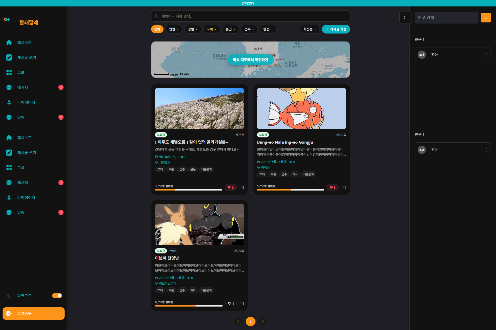
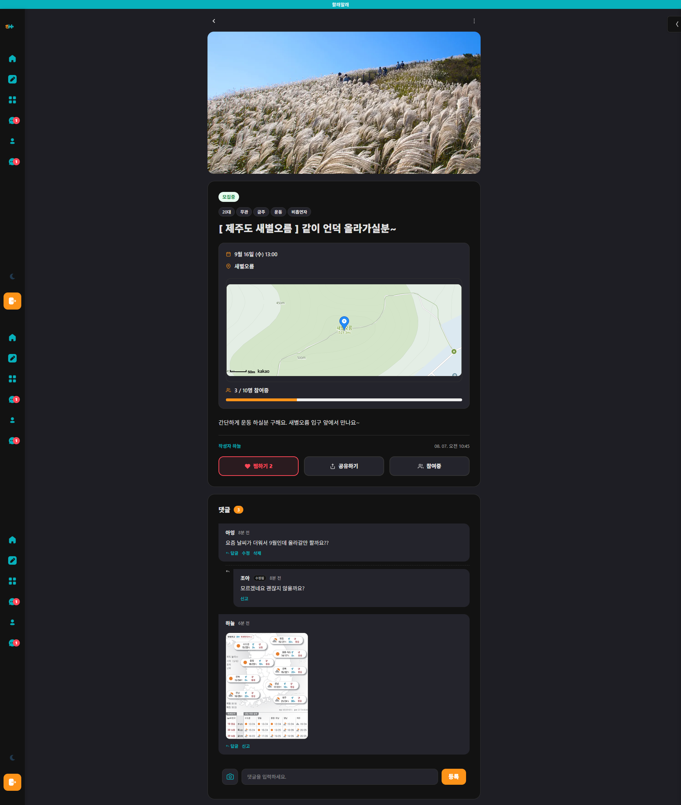

# 💬 할래말래

> 관심사가 비슷한 사람들과 함께할 모임을 만들고 참여할 수 있는 커뮤니티 웹 서비스

[](https://github.com/ilegood/hlml-server)
[](https://github.com/ilegood/hlml-client)

## 📖 Description

**할래말래**는 혼자서는 하기 어려운 활동을 함께할 사람을 찾고,
관심사와 지역, 일정 등의 조건을 기반으로 새로운 모임을 만들고 참여할 수 있도록 지원하는 커뮤니티 웹 서비스입니다.

사용자는 다양한 카테고리의 모임을 탐색하고,
원하는 조건에 맞는 모임을 생성하거나 참여할 수 있습니다.

또한 모임 참여자 간 실시간 채팅을 통해
모임에 대한 정보를 공유하고 소통할 수 있도록 구현했습니다.

본 Repository는 **할래말래의 Backend Server**입니다.

Frontend와 Backend를 분리하여 개발했으며,
Frontend는 별도의 Repository에서 관리합니다.

- 🌐 **Service:** https://hlml-bice.vercel.app/
- 💻 **Frontend:** https://github.com/ilegood/hlml-client
- ⚙️ **Backend:** https://github.com/ilegood/hlml-server

---

## 📅 Project Info

| 항목 | 내용 |
|---|---|
| 개발 기간 | 2026.03.16 ~ 2026.04.20 |
| 개발 인원 | 3명 |
| 프로젝트 유형 | 팀 프로젝트 |
| 담당 분야 | Full-Stack Development |
| Backend | Node.js / Express |
| Frontend | React / Vite |
| Database | MySQL |
| Deployment | Vercel / Fly.io |

---

## 🎥 Demo

### 🌐 Live Service

[할래말래 바로가기](https://hlml-bice.vercel.app/)

### 📸 Screenshots

<table>
  <tr>
    <td align="center">
      
    </td>
    <td align="center">
      
    </td>
  </tr>
  <tr>
    <td align="center"><b>메인 / 모임 탐색</b></td>
    <td align="center"><b>로그인 / 회원가입</b></td>
  </tr>
  <tr>
    <td align="center">
      
    </td>
    <td align="center">
      
    </td>
  </tr>
  <tr>
    <td align="center"><b>모임 게시글</b></td>
    <td align="center"><b>실시간 채팅</b></td>
  </tr>
</table>

# ⭐ Main Features

## 👤 회원가입 / 로그인

사용자의 계정을 생성하고 서비스에 로그인할 수 있도록
회원 인증 시스템을 구현했습니다.

- 회원가입
- 로그인
- 이메일 인증
- 비밀번호 암호화
- JWT 기반 인증
- 회원 정보 관리

비밀번호는 `bcrypt`를 이용하여 암호화하여 저장하고,
로그인 이후 JWT를 이용하여 인증이 필요한 API에 접근할 수 있도록 구성했습니다.

---

## 🏠 모임 탐색

사용자가 원하는 모임을 쉽게 찾을 수 있도록
다양한 조건을 활용한 모임 탐색 기능을 제공합니다.

- 카테고리별 검색
- 지역별 검색
- 날짜 검색
- 시간 검색
- 모임 태그
- 모임 모집 인원 확인

---

## 👥 모임 생성 및 참여

사용자가 직접 모임을 생성하고
다른 사용자가 해당 모임에 참여할 수 있도록 구현했습니다.

모임에는 다음과 같은 정보를 등록할 수 있습니다.

- 모임 제목
- 모임 설명
- 카테고리
- 태그
- 날짜
- 시간
- 장소
- 지도 위치
- 모집 인원
- 모임 이미지

모임 참여자는 별도의 참가자 데이터로 관리하여
현재 참여 인원과 모집 상태를 관리할 수 있도록 구성했습니다.

---

## 📝 게시글 / 댓글

모임을 중심으로 커뮤니티 기능을 제공하기 위해
게시글과 댓글 시스템을 구현했습니다.

### 게시글

- 게시글 작성
- 게시글 수정
- 게시글 삭제
- 게시글 좋아요
- 게시글 신고
- 게시글 이미지
- 모집 상태 관리

### 댓글

- 댓글 작성
- 댓글 수정
- 댓글 삭제
- 대댓글
- 댓글 이미지
- 댓글 신고

---

## 💬 실시간 채팅

모임 참여자들이 실시간으로 소통할 수 있도록
**Socket.IO 기반의 실시간 채팅 시스템**을 구현했습니다.

### 주요 기능

- 모임별 채팅방
- 실시간 메시지 전송
- 메시지 저장
- 메시지 수정
- 메시지 삭제
- 메시지 답장
- 메시지 이모지 반응
- 메시지 읽음 상태
- 1:1 DM

실시간으로 전달되는 메시지를 MySQL에 저장하여
채팅이 종료된 이후에도 이전 대화 내용을 확인할 수 있도록 구성했습니다.

---

## 👤 마이페이지

사용자가 자신의 정보를 확인하고 관리할 수 있도록
마이페이지 기능을 구현했습니다.

- 프로필 정보 조회
- 프로필 이미지
- 닉네임
- 자기소개
- 주소
- 생년월일
- 성별
- 관심 카테고리
- 회원 정보 수정
- 관심사 수정
- 회원 탈퇴

---

## 🚨 신고 / 차단

서비스 내에서 발생할 수 있는 부적절한 사용자 및 콘텐츠에 대응하기 위해
신고 및 차단 기능을 구현했습니다.

- 사용자 신고
- 게시글 신고
- 댓글 신고
- 모임 내 사용자 차단
- 신고 상태 관리

---

# 🛠️ Tech Stack

## Backend

| 기술 | 사용 목적 |
|---|---|
| **Node.js** | 서버 실행 환경 |
| **Express.js** | REST API 서버 구축 |
| **MySQL** | 사용자 / 모임 / 게시글 / 채팅 데이터 관리 |
| **JWT** | 사용자 인증 및 로그인 상태 관리 |
| **bcrypt** | 사용자 비밀번호 암호화 |
| **Socket.IO** | 실시간 채팅 구현 |
| **Multer** | 이미지 파일 업로드 처리 |
| **Sharp** | 이미지 리사이징 및 가공 |
| **Cloudinary** | 이미지 저장 및 관리 |
| **Nodemailer** | 이메일 인증 |
| **node-cron** | 주기적인 서버 작업 처리 |
| **dotenv** | 환경 변수 관리 |
| **CORS** | Client-Server 간 요청 허용 |

## Frontend

| 기술 | 사용 목적 |
|---|---|
| **React** | 사용자 인터페이스 구축 |
| **Vite** | Frontend 개발 및 빌드 |
| **JavaScript** | Client 로직 구현 |
| **Socket.IO Client** | 실시간 채팅 통신 |

## Deployment / DevOps

| 기술 | 사용 목적 |
|---|---|
| **Git / GitHub** | 버전 관리 및 협업 |
| **GitHub Actions** | 배포 자동화 |
| **Docker** | Backend 실행 환경 구성 |
| **Fly.io** | Backend 배포 |
| **Vercel** | Frontend 배포 |

> Backend의 실제 `package.json`에는 Express, MySQL2, JWT, bcrypt, Socket.IO, Multer, Sharp, Cloudinary, Nodemailer, node-cron 등이 포함되어 있습니다.
> :contentReference[oaicite:2]{index=2}

---

# 🏗️ Server Architecture

Backend는 기능별 책임을 분리하여
유지보수와 기능 확장이 용이하도록 구성했습니다.

```text
                    Client
                      │
             HTTP / WebSocket
                      │
                      ▼
              ┌───────────────┐
              │    Express    │
              └───────┬───────┘
                      │
               ┌──────▼──────┐
               │    Routes   │
               └──────┬──────┘
                      │
               ┌──────▼──────┐
               │ Middleware  │
               └──────┬──────┘
                      │
             ┌────────▼────────┐
             │   Controller    │
             └────────┬────────┘
                      │
             ┌────────▼────────┐
             │    Service      │
             └────────┬────────┘
                      │
             ┌────────▼────────┐
             │   Repository    │
             └────────┬────────┘
                      │
             ┌────────▼────────┐
             │      MySQL      │
             └─────────────────┘

       ┌────────────────────────────┐
       │        Socket.IO           │
       │      Real-time Chat        │
       └────────────────────────────┘

       ┌────────────────────────────┐
       │          Workers           │
       │ Appointment / Post Jobs    │
       └────────────────────────────┘
